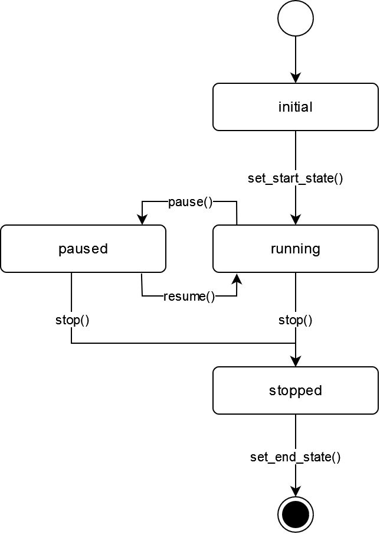

:mod:`control` --- thread control mixin
=======================================

.. py:currentmodule:: src.thread_extension.control

ThreadControlMixin Objects
--------------------------

The :class:`ThreadControlMixin` class extends typical `Threads objects
<https://docs.python.org/3/library/threading.html#thread-objects>`_ by
adding additional events to pause and stop threads at runtime.
This is especially useful in case of continuous running activities e.g.
monitoring tasks or batch jobs processed in the background.

The following state diagram illustrates the control flow of the mixin.

.. _link-status-diagram:

To make use of this functionality simply create a new custom thread and
subclass the :class:`ThreadControlMixin` class as shown in the following
example. From this point on everything works like a conventional thread.

.. code-block:: python

   from threading import Thread
   from control import ThreadControlMixin

   class MyThread(Thread, ThreadControlMixin):
       def __init__(self):
           Thread.__init__(self)
           ThreadControlMixin.__init__(self)

       def run(self):
          pass  # Put your code here

.. class:: ThreadControlMixin

   This class extends a thread of control by providing events to pause and
   stop a thread at runtime.

   .. py:attribute:: status

      A string used for internal status tracking only. Can be one of the following options
      ``initial``, ``running``, ``paused`` or ``stopped``. For more information please
      refer to the :ref:`Status Diagram <link-status-diagram>` section.

   .. method:: is_running()

      This method returns ``True`` just after the :meth:`~ThreadControlMixin.set_start_state`
      method terminates until just after the :meth:`~ThreadControlMixin.set_end_state` method
      terminates. In between is indicates whether a :meth:`~ThreadControlMixin.pause` Event
      is set, by returning ``False``.

   .. method:: is_stopped()

      This method returns ``True`` just after the :meth:`~ThreadControlMixin.stop` Event
      triggers for the first time.

   .. method:: pause()

      This method triggers a pause event.

   .. method:: resume()

      This method resets a :meth:`~ThreadControlMixin.pause` Event.

   .. method:: stop()

      This method triggers a stop event.

   .. method:: wait(timeout=None)

      This method waits until a :meth:`~ThreadControlMixin.pause` Event is reset.

      When the *timeout* argument is present and not ``None``, it should be a
      floating point number specifying a timeout for the operation in seconds
      (or fractions thereof).

   .. method:: set_start_state()

      TBD.

   .. method:: set_end_state()

      TBD.
