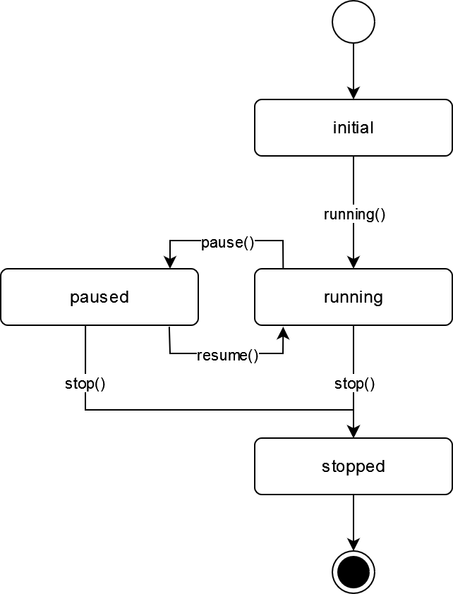

:mod:`control` --- thread control mixin
=======================================

.. py:currentmodule:: src.thread_extension.control

The :class:`ThreadControlMixin` class extends typical `Threads objects <https://docs.python.org
/3/library/threading.html#thread-objects>`_ by adding a state machine. It allows thread objects
to make use of additional control states to enable pause, resume and stop events at runtime.
This is especially useful in case of continuous running activities e.g. monitoring tasks or
batch jobs processed in the background.

.. _link-state-diagram:

The following state diagram illustrates the control flow of the mixin.

To make use of this functionality simply create a new custom thread and subclass the
:class:`ThreadControlMixin` class as shown in the following example. From this point
on everything works like a conventional thread.

.. code-block:: python

   from threading import Thread
   from control import ThreadControlMixin

   class MyThread(Thread, ThreadControlMixin):
       def __init__(self):
           Thread.__init__(self)
           ThreadControlMixin.__init__(self)

       def run(self):
          pass  # Put your code here

.. class:: ThreadControlMixin

    This class implements a state machine allowing thread objects to make use of
    additional control states to enable pause, resume and stop events at runtime.

   .. py:attribute:: state

      A string used for internal state tracking only. Can be one of the following options
      ``initial``, ``running``, ``paused`` or ``stopped``. For more information please
      refer to the :ref:`State Diagram <link-state-diagram>` section.

   .. method:: is_initial()

      This method returns ``True`` if the object is in ``initial`` state and ``False``
      otherwise.

   .. method:: is_running()

      This method returns ``True`` if the object is in ``running`` state and ``False``
      otherwise.

   .. method:: is_paused()

      This method returns ``True`` if the object is in ``paused`` state and ``False``
      otherwise.

   .. method:: is_stopped()

      This method returns ``True`` if the object is in ``stopped`` state and ``False``
      otherwise.

   .. method:: running()

      This method puts the object from ``initial`` into ``running`` state and can only
      be called once.

      :meth:`~ThreadControlMixin.running` raises a :exc:`MachineError` if called more
      than once on the same object.

   .. method:: pause()

      This method puts the object from ``running`` into ``paused`` state.

      :meth:`~ThreadControlMixin.pause` raises a :exc:`MachineError` if an attempt is
      made to pause the current object during ``initial`` or ``stopped`` state.

   .. method:: resume()

      This method puts the object from ``paused`` into ``running`` state.

      :meth:`~ThreadControlMixin.resume` raises a :exc:`MachineError` if an attempt is
      made to resume the current object during ``initial`` or ``stopped`` state.

   .. method:: stop()

      This method puts the object from ``paused`` or ``running`` into ``stopped`` state.

      :meth:`~ThreadControlMixin.stop` raises a :exc:`MachineError` if an attempt is
      made to stop the current object during ``initial`` state.

   .. method:: wait(timeout=None)

      This method waits until the object is in ``running`` state.

      When the *timeout* argument is present and not ``None``, it should be a
      floating point number specifying a timeout for the operation in seconds
      (or fractions thereof).
